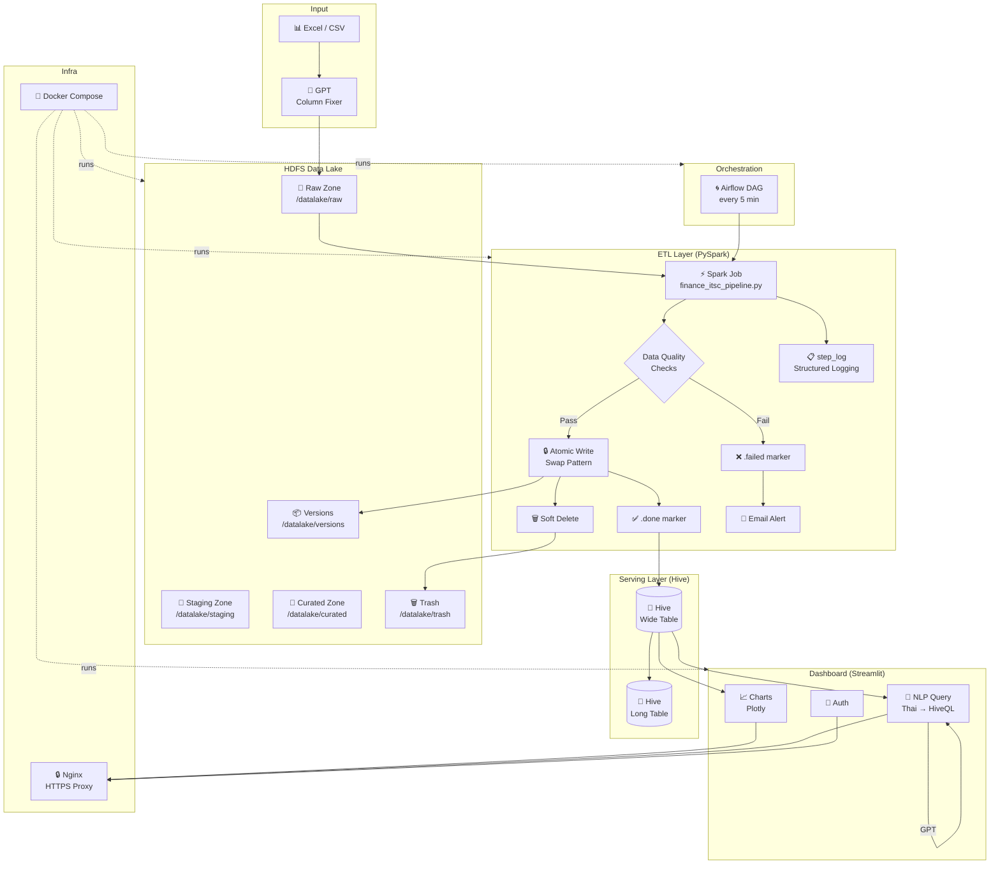
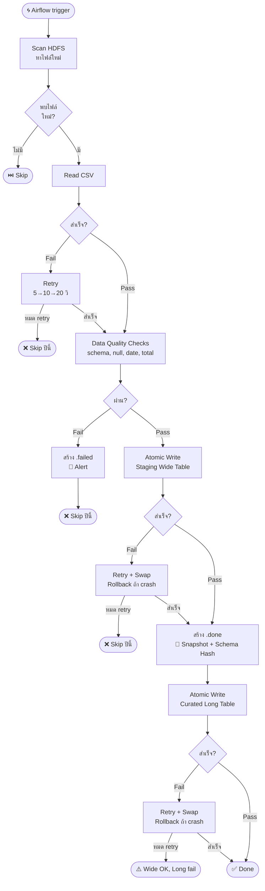
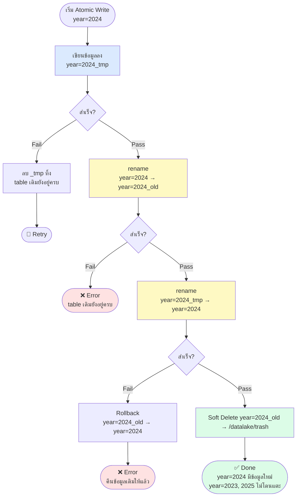

[](https://github.com/Qaizx/hadoop-data-pipeline/actions/workflows/ci.yml)

# Finance ITSC Dashboard

ระบบ Data Lake และ Dashboard สำหรับวิเคราะห์งบประมาณ ITSC มหาวิทยาลัยเชียงใหม่

## Architecture



**Stack**
- **Data Lake**: Hadoop HDFS + Hive Metastore
- **ETL**: Apache Spark (PySpark)
- **Orchestration**: Apache Airflow
- **Dashboard**: Streamlit + Plotly
- **NLP**: OpenAI GPT → HiveQL
- **Proxy**: Nginx (HTTPS)

## Project Structure

```
HADOOP_NEW/
├── airflow/
│   ├── dags/               # Airflow DAGs
│   └── Dockerfile.airflow
├── dashboard/
│   ├── components/         # Streamlit UI components
│   ├── pages/
│   │   ├── upload.py       # Excel upload + column mapping
│   │   └── monitoring.py   # Pipeline status + DQ + versions
│   ├── services/           # Hive + GPT integration
│   ├── utils/              # History, helpers
│   ├── app.py              # Entry point (NLP query)
│   ├── auth.py             # Authentication
│   └── config.py           # Table schema, category mapping
├── jobs/
│   ├── finance_itsc_pipeline_quality.py  # Spark ETL entry point
│   ├── data_quality.py                   # Data Quality checks
│   ├── logger.py                         # Structured logging + step_log
│   ├── manage.py                         # Dataset CLI (versions/diff/restore/cleanup)
│   ├── utils/
│   │   ├── hdfs.py                       # HDFS helpers
│   │   ├── alerts.py                     # Email alerts
│   │   ├── retry.py                      # Retry + Atomic write
│   │   ├── soft_delete.py                # Soft delete → trash
│   │   ├── schema_evolution.py           # ALTER TABLE สำหรับ column ใหม่
│   │   └── versioning.py                 # Snapshot, rollback, schema hash, diff
│   └── scripts/                          # Utility scripts (manual run)
│       ├── check_hdfs_integrity.py
│       ├── fix_hdfs_integrity.py
│       ├── diff_test.py
│       └── restore.py
├── tests/
│   ├── conftest.py         # Shared fixtures และ mock helpers
│   ├── test_atomic_write.py
│   ├── test_category_mapping.py
│   ├── test_etl.py
│   ├── test_idempotency.py
│   ├── test_manage.py
│   ├── test_pipeline_spark.py
│   ├── test_soft_delete.py
│   ├── test_sql_safety.py
│   ├── test_step_log.py
│   └── test_versioning.py
├── docs/
│   ├── versioning.md       # คู่มือ versioning, rollback, manage.py CLI
│   ├── manage.md           # manage.py CLI reference
│   └── auth_setup.md       # ขั้นตอนตั้งค่า Auth
├── certs/                  # SSL certificates (ไม่ commit)
├── data/                   # Raw data files (ไม่ commit)
├── docker-compose.yaml
├── nginx.conf
├── run_tests.sh            # Script รัน tests ทั้งหมดใน Docker
└── .env                    # ไม่ commit — ดู .env.example
```

## Prerequisites

- Docker + Docker Compose
- OpenAI API Key
- Gmail App Password (สำหรับ email alerts)

## Setup

**1. Clone และตั้งค่า environment**
```bash
git clone <repo-url>
cd HADOOP_NEW
cp .env.example .env
# แก้ไข .env ใส่ค่าจริง
```

**2. สร้าง SSL Certificate**
```bash
# Windows (Git Bash)
bash generate_cert.sh

# Linux/Mac
openssl req -x509 -nodes -days 365 -newkey rsa:2048 \
    -keyout certs/server.key \
    -out certs/server.crt \
    -subj "/C=TH/ST=ChiangMai/O=ITSC-CMU/CN=localhost"
```

**3. สร้าง config.py จาก example**
```bash
cp dashboard/config.py.example dashboard/config.py
# แก้ไข config.py ตามต้องการ
```

**4. รัน Docker Compose**
```bash
docker compose up -d
```

**5. ตั้งค่า Airflow**
```bash
# เข้า Airflow UI: http://localhost:8088
# Admin → Variables → เพิ่ม:
#   Key: alert_email
#   Value: your-email@gmail.com
```

**6. Upload ข้อมูลเข้า HDFS**
```bash
# สร้าง directory structure
docker exec namenode hdfs dfs -mkdir -p /datalake/raw/finance_itsc/year=2024

# Upload CSV
docker exec -i namenode hdfs dfs -put /data/finance_itsc_2024.csv \
    /datalake/raw/finance_itsc/year=2024/
```

## Environment Variables

ตั้งค่าใน `.env`:

| Variable | Default | Description |
|----------|---------|-------------|
| `OPENAI_API_KEY` | — | GPT column mapping, NLP query, Excel conversion |
| `GMAIL_APP_PASSWORD` | — | Email alerts เมื่อ pipeline fail |
| `SECRET_KEY` | — | Streamlit session encryption |
| `COOKIE_SECRET` | — | Cookie-based auth encryption |
| `WEBHDFS_URL` | `http://namenode:50070` | Dashboard เชื่อมต่อ HDFS |
| `ETL_MAX_RETRIES` | `3` | จำนวนครั้ง retry เมื่อ step fail |
| `ETL_RETRY_DELAY` | `5` | วินาทีรอก่อน retry (x2 ทุกรอบ) |
| `KEEP_VERSIONS` | `5` | จำนวน version ที่เก็บต่อปี |
| `LOG_DIR` | `/jobs/logs` | path สำหรับเก็บ log files |

## Services

| Service | URL | หมายเหตุ |
|---------|-----|---------|
| Dashboard | https://localhost | หน้าหลัก NLP Query |
| Upload | https://localhost/upload | Excel upload + column mapping |
| Monitoring | https://localhost/monitoring | Pipeline status + DQ |
| Airflow | http://localhost:8088 | Pipeline management |
| Spark Master | http://localhost:8080 | หรือ https://localhost/spark/ |
| HDFS NameNode | http://localhost:9870 | |
| Hive Server | localhost:10000 | JDBC |

## Dashboard

Dashboard แบ่งเป็น 3 ส่วนหลัก เข้าถึงได้ที่ `https://localhost`

### หน้าหลัก — NLP Query

ถามคำถามเกี่ยวกับงบประมาณเป็นภาษาไทยได้เลย GPT จะแปลงเป็น HiveQL และแสดงผลเป็นกราฟอัตโนมัติ

```
ตัวอย่างคำถาม:
- "ค่าใช้สอยปี 2024 เป็นเท่าไร"
- "หมวดไหนมียอดคงเหลือน้อยที่สุด"
- "เปรียบเทียบค่าใช้จ่ายแต่ละเดือน"
```

**กฎสำคัญของ query engine:**
- `details = 'remaining'` คือ running balance — ดึงเฉพาะเดือนล่าสุดเสมอ ห้าม SUM
- `details = 'budget'` และ `details = 'spent'` — SUM ได้ปกติ
- `date` เป็น reserved keyword — pipeline จะใส่ backtick ให้อัตโนมัติ

---

### หน้า Upload — Excel → HDFS

**4 ขั้นตอน:**

**Step 1 — เลือก Folder ปลายทาง**

Browse HDFS `/datalake/raw` ผ่าน UI ได้เลย มี breadcrumb navigation และสร้าง folder ใหม่ได้โดยไม่ต้องใช้ command line ระบบจะ infer ชื่อ Hive table จากชื่อ folder อัตโนมัติ

**Step 2 — Upload Excel**

- รองรับ `.xlsx` พร้อมเลือก sheet ได้
- กด **🤖 แปลงด้วย GPT** — GPT จะจัดการ merged cells, header หลายชั้น, และ format ให้เป็น CSV สะอาด
- Preview ผลลัพธ์ 10 rows แรกก่อน proceed

**Step 3 — Column Mapping**

ระบบเปรียบเทียบ columns ใน CSV กับ Hive schema อัตโนมัติ:

| สถานะ | ความหมาย |
|-------|----------|
| ✅ ตรงกัน | ชื่อ column ตรงกับ Hive ทุกตัว |
| 🔀 Remap | user เลือก map CSV column → Hive column อื่น |
| 🆕 สร้างใหม่ | column ใหม่ที่ยังไม่มีใน Hive — pipeline จะ `ALTER TABLE` เพิ่มให้อัตโนมัติตอนรัน |
| `null` | Hive column ที่ไม่มีใน CSV — จะถูก set เป็น null |

ชื่อ column แต่ละตัวแสดงทั้งภาษาไทยและชื่อจริงคู่กัน (GPT แปลให้อัตโนมัติ) critical columns ที่ขาดไม่ได้ (`date`, `details`) จะ block การ upload ทันที

**Step 4 — Confirm Upload**

สรุป mapping ทั้งหมดก่อน upload จริง ไฟล์ที่มีชื่อภาษาไทยจะถูก sanitize เป็น `{table_name}_{timestamp}.csv` อัตโนมัติ หลัง upload สำเร็จ Airflow จะ pick up ไฟล์ตาม schedule

---

### หน้า Monitoring

แบ่งเป็น 3 section:

**🚀 Pipeline Runs**

ตารางแสดง 20 run ล่าสุด พร้อม metrics รวม:

| Metric | ความหมาย |
|--------|----------|
| Run ทั้งหมด | จำนวนครั้งที่ pipeline trigger |
| ✅ Success | ทุกปีสำเร็จ |
| ⚠️ Partial | บางปีสำเร็จ บางปี fail |
| ❌ Failed | ทุกปี fail |
| เวลาเฉลี่ย | duration เฉลี่ยต่อ run (วินาที) |

**🔍 Data Quality**

Pass/Fail rate แยกตาม check type แสดงเป็น bar chart และ pie chart พร้อม pass rate รวม

**📦 Version History**

ตารางแสดงทุก snapshot ที่บันทึกไว้ พร้อม rows count และ schema hash ต่อ version กด **🔄 Refresh** ที่มุมบนเพื่ออัพเดทข้อมูลล่าสุด

---

## ETL Pipeline

Pipeline รันอัตโนมัติทุก 5 นาที ผ่าน Airflow DAG `finance_etl_pipeline`



ทุก step มี retry อัตโนมัติพร้อม exponential backoff (5 → 10 → 20 วินาที) และ log ผ่าน `step_log` ทุก step

**Marker files:**
- `filename.csv.done` — processed สำเร็จ พร้อม checksum
- `filename.csv.failed` — Data Quality failed (ต้องแก้ไขก่อน retry)

## Data Quality Checks

| Check | ระดับ | รายละเอียด |
|-------|-------|-----------|
| Schema | Fatal | Column ครบ 32 อัน |
| Null Values | Fatal | date, details ห้าม null |
| Date Format | Fatal | ต้องมี all-year-budget, total spent, remaining |
| Total Amount | Warning | total_amount ≈ sum ทุก column (±1%) |
| Remaining | Warning | remaining ต้องลดหลั่งทุกเดือน |

## Atomic Write & Retry

ป้องกัน partial data เข้า Hive table ด้วย **swap pattern** — เขียนแยก partition เฉพาะปีที่ process ปีอื่นไม่โดนแตะ



## Soft Delete & Trash

แทนที่จะลบข้อมูลทันที ระบบย้ายไปที่ `/datalake/trash/{date}/` ก่อน ทำให้ recover ได้ถ้าพลาด

```bash
# ดู trash ของปีที่ต้องการ
spark-submit /jobs/manage.py trash 2024

# restore จาก trash (ถ้าต้องการ)
# ดูรายละเอียดใน docs/manage.md
```

Trash จะถูก purge อัตโนมัติเมื่ออายุเกิน 30 วัน

## Data Versioning

ทุกครั้งที่ ETL สำเร็จจะสร้าง snapshot อัตโนมัติ พร้อม **schema hash** สำหรับ detect การเปลี่ยน schema เก็บไว้ **5 version ล่าสุด** ต่อปี

**ผ่าน manage.py CLI (แนะนำ):**
```bash
# ดู versions ทั้งหมดของปี 2024
spark-submit /jobs/manage.py versions 2024

# เปรียบเทียบ 2 versions
spark-submit /jobs/manage.py diff 2024 v_20260301_120000 v_20260215_090000

# restore version เก่า
spark-submit /jobs/manage.py restore 2024 v_20260215_090000 --yes

# ลบ versions เก่า เก็บไว้ 5 ล่าสุด
spark-submit /jobs/manage.py cleanup 2024 --keep 5 --yes
```

ดูรายละเอียดเพิ่มเติมได้ที่ [docs/versioning.md](docs/versioning.md) และ [docs/manage.md](docs/manage.md)

## Structured Logging

ทุก step ใน pipeline log ผ่าน `step_log` context manager อัตโนมัติ:

```
2026-03-06 12:00:01 | INFO | [dataset=finance_itsc] [step=transform] START
2026-03-06 12:00:03 | INFO | [dataset=finance_itsc] [step=transform] SUCCESS (2341ms) rows=1500
2026-03-06 12:00:03 | ERROR | [dataset=finance_itsc] [step=atomic_write] FAILED (810ms) — disk full
```

ดู logs:
```bash
docker exec spark-master cat /jobs/logs/etl.log
docker exec spark-master cat /jobs/logs/etl.error.log
```

## Running Tests

**รัน tests ทั้งหมดใน Docker (แนะนำ):**
```bash
./run_tests.sh
# หรือเฉพาะไฟล์
./run_tests.sh tests/test_versioning.py
# หรือเฉพาะ test เดียว พร้อม flags
./run_tests.sh tests/test_manage.py -v
```

`run_tests.sh` รัน 132 tests ทั้งหมดใน Docker container (Python 3.7 + PySpark) และ copy reports กลับมาที่ `./reports/` อัตโนมัติ

**Test coverage ทั้งหมด:**

| Test file | ทดสอบอะไร |
|-----------|-----------|
| `test_atomic_write.py` | Swap pattern, retry, rollback, ปีอื่นไม่โดนแตะ |
| `test_versioning.py` | Snapshot, list, cleanup, restore, schema hash, diff |
| `test_soft_delete.py` | Soft delete, trash, purge, restore from trash |
| `test_manage.py` | CLI commands: versions, diff, restore, cleanup |
| `test_step_log.py` | Structured logging, duration, ctx fields, error log |
| `test_idempotency.py` | Checksum, .done marker, skip processed files |
| `test_etl.py` | CSV parsing, year injection, date filter |
| `test_category_mapping.py` | Column mapping, schema diff, critical columns |
| `test_sql_safety.py` | Reserved keyword handling, remaining sum guard |
| `test_pipeline_spark.py` | Wide→Long transform, String→Double cast, PART 2 recovery |

## CI/CD Pipeline

GitHub Actions รัน 6 jobs อัตโนมัติทุกครั้งที่ push:

```
push → lint → test (non-Spark)  ──┬── docker-spark
                                   ├── docker-streamlit
              test-spark (Docker) ─┤── docker-compose-validate
                                   └── airflow-dag-validate
```

| Job | Runtime | ทำอะไร |
|-----|---------|--------|
| **lint** | Python 3.12 | `ruff check` ทุกไฟล์ |
| **test** | Python 3.12 | pytest non-Spark + coverage report |
| **test-spark** | Docker (Python 3.7) | pytest `test_pipeline_spark.py` ใน Spark container |
| **docker-spark** | — | Build `Dockerfile.spark` |
| **docker-streamlit** | — | Build `Dockerfile.streamlit` |
| **docker-compose-validate** | — | `docker compose config` |
| **airflow-dag-validate** | Python 3.10 + Airflow 2.9 | Import DAGs ทุกตัว |

Coverage report upload เป็น artifact ทุก run ดูได้ที่ Actions tab

## Contributing

**Setup local development:**
```bash
git clone <repo-url>
cd HADOOP_NEW
python -m venv .venv
# Windows
.venv\Scripts\activate
# Linux/Mac
source .venv/bin/activate

pip install -r requirements.txt
pip install pytest pytest-cov pytest-mock ruff
```

**ก่อน commit ทุกครั้ง:**
```bash
# lint
ruff check . --exclude backup_file

# fix อัตโนมัติ (บางส่วน)
ruff check . --fix --unsafe-fixes --exclude backup_file

# test ทั้งหมด (ต้อง docker compose up ก่อน)
./run_tests.sh
```

**เพิ่ม column ใหม่:**

1. Upload Excel ที่มี column ใหม่ผ่านหน้า Upload → เลือก **🆕 สร้าง column ใหม่**
2. Pipeline จะ `ALTER TABLE` เพิ่ม column อัตโนมัติตอนรัน
3. อัพเดท `CATEGORY_MAPPING` ใน `dashboard/config.py` เพื่อให้ NLP query รู้จัก column ใหม่

## Troubleshooting

**Spark ใช้ Python ผิด version**
```bash
# ตรวจสอบ PYSPARK_PYTHON ใน docker-compose.yaml
- PYSPARK_PYTHON=python3
- PYSPARK_DRIVER_PYTHON=python3
```

**Hive reserved keyword error**
```
Pipeline จะ auto-fix `date` → `\`date\`` อัตโนมัติ
```

**HDFS ไม่ขึ้น**
```bash
docker compose restart namenode datanode
```

**Dashboard ไม่อัพเดทหลังแก้โค้ด**
```bash
docker compose restart streamlit-dashboard
```

**ดู logs ของ ETL pipeline**
```bash
# log ทั้งหมด
docker exec spark-master cat /jobs/logs/etl.log

# เฉพาะ error
docker exec spark-master cat /jobs/logs/etl.error.log
```

**Trash เต็ม — purge manually**
```bash
spark-submit /jobs/manage.py trash 2024
# ดูแล้วค่อย cleanup versions
spark-submit /jobs/manage.py cleanup 2024 --keep 5 --yes
```