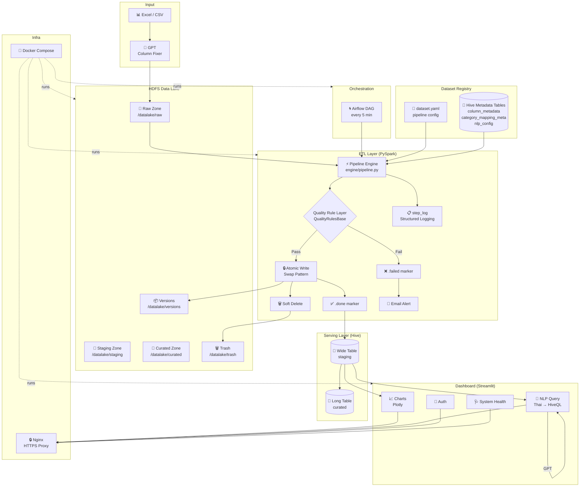
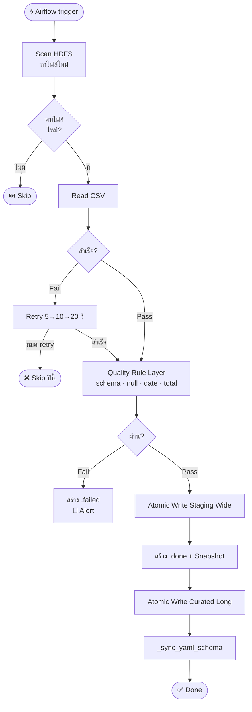
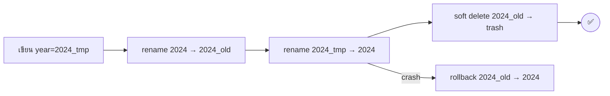

[](https://github.com/Qaizx/hadoop-data-pipeline/actions/workflows/ci.yml)

# Finance ITSC Dashboard

ระบบ Data Lake และ Dashboard สำหรับวิเคราะห์งบประมาณ ITSC มหาวิทยาลัยเชียงใหม่

## Architecture



**Stack**
- **Data Lake**: Hadoop HDFS + Hive Metastore
- **ETL**: Apache Spark (PySpark)
- **Orchestration**: Apache Airflow
- **Dashboard**: Streamlit + Plotly
- **NLP**: OpenAI GPT → HiveQL
- **Proxy**: Nginx (HTTPS)

## Project Structure

```
HADOOP_NEW/
├── airflow/
│   ├── dags/                    # Airflow DAGs
│   └── Dockerfile.airflow
├── dashboard/
│   ├── components/
│   │   ├── sidebar.py           # Year selector + Quick Stats (guard year=None)
│   │   └── hdfs_browser.py      # HDFS file browser component
│   ├── pages/
│   │   ├── upload.py            # Excel upload + column mapping
│   │   ├── hdfs_browser.py      # HDFS browser page
│   │   └── monitoring.py        # System Health + Pipeline status + DQ + versions
│   ├── services/
│   │   ├── hive_gpt.py          # Hive query + GPT NLP
│   │   ├── hive_metadata.py     # Read/write Hive metadata tables
│   │   ├── monitoring.py        # Pipeline run parser + get_health_status()
│   │   └── schema_service.py    # Dataset yaml generator
│   ├── utils/
│   ├── app.py                   # Entry point (NLP query)
│   ├── auth.py                  # Authentication
│   └── config.py
├── jobs/
│   ├── datasets/
│   │   ├── registry.py          # Dataset Registry — loads yaml + Hive metadata
│   │   ├── finance.yaml         # finance_itsc pipeline config
│   │   └── *.yaml               # datasets อื่นๆ ที่เพิ่มผ่านหน้า Upload
│   ├── engine/
│   │   ├── pipeline.py          # Generic Pipeline Engine (ใช้ DatasetConfig)
│   │   └── run_pipeline.py      # spark-submit entry point + _resolve_dataset_name()
│   ├── quality_rules/
│   │   ├── base.py              # QualityRulesBase — check_schema, run_checks
│   │   └── finance_rules.py     # FinanceQualityRules — อ่าน config จาก registry
│   ├── utils/
│   │   ├── hdfs.py              # HDFS helpers
│   │   ├── alerts.py            # Email alerts
│   │   ├── retry.py             # Retry + Atomic write + partition register
│   │   ├── soft_delete.py       # Soft delete → trash
│   │   └── versioning.py        # Snapshot, rollback, schema hash, diff
│   ├── scripts/
│   │   ├── check_hdfs_integrity.py   # ตรวจ partition sync + .done files (--dataset flag)
│   │   ├── fix_hdfs_integrity.py     # แก้ partition + MSCK REPAIR (--dataset flag)
│   │   └── seed_finance_metadata.py  # One-time seed Hive metadata สำหรับ finance_itsc
│   └── manage.py                # Dataset CLI — --dataset flag + info/versions/diff/restore/cleanup
├── tests/
│   ├── conftest.py
│   ├── test_atomic_write.py
│   ├── test_category_mapping.py
│   ├── test_etl.py
│   ├── test_idempotency.py
│   ├── test_manage.py           # CLI commands ผ่าน generic --dataset
│   ├── test_pipeline_engine.py  # Generic pipeline engine + registry integration
│   ├── test_pipeline_spark.py   # Wide→Long transform (รันใน Docker)
│   ├── test_quality_rules.py    # FinanceQualityRules ทุก check
│   ├── test_registry.py         # DatasetConfig, ColumnDef, build_schema_prompt
│   ├── test_soft_delete.py
│   ├── test_sql_safety.py
│   ├── test_step_log.py
│   └── test_versioning.py
├── scripts/
│   └── clean_dataset.sh         # Cleanup dataset ทุก layer (HDFS + Hive + yaml + metadata)
├── docs/
│   ├── versioning.md
│   ├── manage.md
│   └── auth_setup.md
├── docker-compose.yaml
├── nginx.conf
├── run_tests.sh
└── .env
```

## Prerequisites

- Docker + Docker Compose
- OpenAI API Key
- Gmail App Password (สำหรับ email alerts)

## Setup

**1. Clone และตั้งค่า environment**
```bash
git clone <repo-url>
cd HADOOP_NEW
cp .env.example .env
# แก้ไข .env ใส่ค่าจริง
```

**2. สร้าง SSL Certificate**
```bash
# Windows (Git Bash)
bash generate_cert.sh

# Linux/Mac
openssl req -x509 -nodes -days 365 -newkey rsa:2048 \
    -keyout certs/server.key \
    -out certs/server.crt \
    -subj "/C=TH/ST=ChiangMai/O=ITSC-CMU/CN=localhost"
```

**3. สร้าง config.py จาก example**
```bash
cp dashboard/config.py.example dashboard/config.py
# แก้ไข HIVE_HOST, WEBHDFS_URL ถ้าจำเป็น
```

**4. รัน Docker Compose**
```bash
docker compose up -d
```

**5. ตั้งค่า Airflow**
```bash
# เข้า Airflow UI: http://localhost:8088
# Admin → Variables → เพิ่ม:
#   Key: alert_email
#   Value: your-email@gmail.com
#
# ถ้าต้องการ pipeline รันกับ dataset อื่น:
#   Key: dataset_name
#   Value: finance_itsc   (หรือ dataset ที่ต้องการ)
```

**6. Upload ข้อมูลเข้า HDFS**

ใช้หน้า Upload ใน Dashboard หรือ manual:
```bash
docker exec namenode hdfs dfs -mkdir -p /datalake/raw/finance_itsc/year=2024
docker exec -i namenode hdfs dfs -put /data/finance_itsc_2024.csv \
    /datalake/raw/finance_itsc/year=2024/
```

## Environment Variables

| Variable | Default | Description |
|----------|---------|-------------|
| `OPENAI_API_KEY` | — | GPT column mapping, NLP query, Excel conversion |
| `GMAIL_APP_PASSWORD` | — | Email alerts เมื่อ pipeline fail |
| `COOKIE_SECRET` | — | Cookie-based auth encryption |
| `WEBHDFS_URL` | `http://namenode:50070` | Dashboard เชื่อมต่อ HDFS |
| `ETL_MAX_RETRIES` | `3` | จำนวนครั้ง retry เมื่อ step fail |
| `ETL_RETRY_DELAY` | `5` | วินาทีรอก่อน retry (x2 ทุกรอบ) |
| `KEEP_VERSIONS` | `5` | จำนวน version ที่เก็บต่อปี |
| `LOG_DIR` | `/jobs/logs` | path สำหรับเก็บ log files |
| `DATASETS_DIR` | `/jobs/datasets` | path สำหรับ dataset yaml files |

## Services

| Service | URL | หมายเหตุ |
|---------|-----|---------|
| Dashboard | https://localhost | หน้าหลัก NLP Query |
| Upload | https://localhost/upload | Excel upload + column mapping |
| Monitoring | https://localhost/monitoring | System Health + Pipeline status |
| Airflow | http://localhost:8088 | Pipeline management |
| Spark Master | http://localhost:8080 | |
| HDFS NameNode | http://localhost:9870 | |
| Hive Server | localhost:10000 | JDBC |

## Dataset Registry

ระบบแบ่ง source of truth เป็น 2 ส่วนชัดเจน:

| แหล่ง | เก็บอะไร |
|-------|---------|
| **yaml** (`jobs/datasets/*.yaml`) | pipeline config: paths, tables, id_columns, partition_by, required_columns, amount_columns |
| **Hive metadata tables** | column schema, category mapping, NLP rules, example queries |

Hive metadata tables ใช้ partition แทน ACID:
```sql
column_metadata        PARTITIONED BY (ds STRING)
category_mapping_meta  PARTITIONED BY (dataset_name STRING)
nlp_config             PARTITIONED BY (dataset_name STRING)
```

ใช้งาน registry:
```python
from datasets.registry import load_dataset

ds = load_dataset("finance_itsc")   # โหลด yaml + Hive อัตโนมัติ, fallback yaml ถ้า Hive ไม่ได้
ds.staging_table    # "finance_itsc_wide"
ds.curated_table    # "finance_itsc_long"
ds.id_columns       # ["date", "details", "year"]
ds.amount_columns   # [...] จาก Hive หรือ pipeline section ใน yaml
ds.col("date")      # ColumnDef(name="date", col_type="STRING", reserved_keyword=True, ...)
```

## Dashboard

### หน้าหลัก — NLP Query

ถามคำถามเกี่ยวกับงบประมาณเป็นภาษาไทย GPT จะแปลงเป็น HiveQL และแสดงผลเป็นกราฟอัตโนมัติ

```
ตัวอย่างคำถาม:
- "ค่าใช้สอยปี 2024 เป็นเท่าไร"
- "หมวดไหนมียอดคงเหลือน้อยที่สุด"
- "เปรียบเทียบค่าใช้จ่ายแต่ละเดือน"
```

**กฎสำคัญของ query engine:**
- `details = 'remaining'` คือ running balance — ดึงเฉพาะเดือนล่าสุดเสมอ ห้าม SUM
- `details = 'budget'` และ `details = 'spent'` — SUM ได้ปกติ
- `date` เป็น reserved keyword — pipeline ใส่ backtick ให้อัตโนมัติ

---

### หน้า Upload — Excel → HDFS

**4 ขั้นตอน:**

**Step 1 — เลือก Folder ปลายทาง**

Browse HDFS `/datalake/raw` ผ่าน UI ได้เลย มี breadcrumb navigation และสร้าง folder ใหม่ได้โดยไม่ต้องใช้ command line

**Step 2 — Upload Excel**

- รองรับ `.xlsx` พร้อมเลือก sheet ได้
- กด **🤖 แปลงด้วย GPT** — GPT จะจัดการ merged cells, header หลายชั้น, และ format ให้เป็น CSV สะอาด
- normalize date format `2023-10-19 00:00:00` → `2023-10` อัตโนมัติ
- Preview ผลลัพธ์ 10 rows แรกก่อน proceed

**Step 3 — Column Mapping**

| สถานะ | ความหมาย |
|-------|----------|
| ✅ ตรงกัน | ชื่อ column ตรงกับ Hive ทุกตัว |
| 🔀 Remap | user เลือก map CSV column → Hive column อื่น |
| 🆕 สร้างใหม่ | column ใหม่ที่ยังไม่มีใน Hive |
| `null` | Hive column ที่ไม่มีใน CSV — set เป็น null |

**Step 4 — Confirm Upload**

สรุป mapping ทั้งหมดก่อน upload จริง ไฟล์ที่มีชื่อภาษาไทยจะถูก sanitize เป็น `{table_name}_{timestamp}.csv` อัตโนมัติ

---

### หน้า Monitoring

**🩺 System Health** — ตรวจสอบ realtime (cache 30 วินาที)

| Check | ตรวจอะไร |
|-------|---------|
| HDFS | namenode reachable ผ่าน WebHDFS `/webhdfs/v1/?op=LISTSTATUS` |
| Hive | hive-server reachable ผ่าน pyhive + `SHOW DATABASES` |
| Datasets | `COUNT(*)` ของ wide/long table ทุก dataset ที่มี yaml |

กด **🔄 Refresh** เพื่อ clear cache และดึงข้อมูลใหม่ทันที

**🚀 Pipeline Runs** — 20 run ล่าสุด พร้อม metrics รวม (Success / Partial / Failed / เวลาเฉลี่ย)

**🔍 Data Quality** — Pass/Fail rate แยก check type แสดงเป็น chart

**📦 Version History** — snapshots ทุก dataset พร้อม schema hash

---

## ETL Pipeline

Pipeline รันอัตโนมัติทุก 5 นาที ผ่าน Airflow DAG `finance_etl_pipeline`



ทุก step มี retry อัตโนมัติพร้อม exponential backoff (5 → 10 → 20 วินาที) และ partition register ผ่าน pyhive โดยตรง (ไม่ต้อง `MSCK REPAIR` หลัง run)

Pipeline engine เป็น generic — รันได้ทุก dataset ผ่าน `DatasetConfig` ไม่มีชื่อ dataset hardcode

**`_sync_yaml_schema`** — หลัง curated write เสร็จทุกรอบ pipeline จะ `DESCRIBE` Hive table แล้วเปรียบเทียบกับ yaml schema อัตโนมัติ:
- column ใหม่ใน Hive → เพิ่มเข้า yaml schema (type mapping อัตโนมัติ)
- column หายออกจาก Hive → log warning เท่านั้น ไม่ลบออกจาก yaml
- partition column → ข้ามเสมอ ไม่เพิ่มเข้า schema
- ถ้า Hive ต่อไม่ได้หรือ yaml ไม่พบ → log warning แต่ pipeline ไม่ crash

**Marker files:**
- `filename.csv.done` — processed สำเร็จ พร้อม checksum
- `filename.csv.failed` — Data Quality failed (ต้องแก้ไขก่อน retry)

## Quality Rule Layer

| Check | ระดับ | รายละเอียด |
|-------|-------|-----------|
| Schema | Fatal | `required_columns` ครบ (อ่านจาก registry) |
| Null Values | Fatal | `critical_columns` ห้าม null (อ่านจาก registry) |
| Date Format | Fatal | ต้องมี `all-year-budget` |
| Total Amount | Warning | `total_amount` ≈ sum `amount_columns` (±1%) |
| Remaining | Warning | remaining ต้องลดหลั่งทุกเดือน |

Rules อ่าน config ทั้งหมดจาก `DatasetConfig` — ไม่มี hardcode ใดๆ เพิ่ม dataset ใหม่ไม่ต้องแก้โค้ด

เพิ่ม rule ใหม่ได้โดย override `extra_checks()` ใน subclass:
```python
class MyRules(QualityRulesBase):
    def extra_checks(self, df, filepath):
        return [("My Custom Check", self.check_something(df))]
```

## Dataset CLI — manage.py

```bash
# ทุก command รองรับ --dataset flag (default: finance_itsc)
spark-submit /jobs/manage.py --dataset finance_itsc versions 2024
spark-submit /jobs/manage.py --dataset finance_itsc diff 2024 v_20260301_120000 v_20260215_090000
spark-submit /jobs/manage.py --dataset finance_itsc restore 2024 v_20260215_090000 --yes
spark-submit /jobs/manage.py --dataset finance_itsc cleanup 2024 --keep 5 --yes
spark-submit /jobs/manage.py --dataset finance_itsc info

# ย่อได้ถ้าใช้ finance_itsc
spark-submit /jobs/manage.py versions 2024
```

ดูรายละเอียดเพิ่มเติมที่ [docs/manage.md](docs/manage.md)

## Integrity Scripts

```bash
# ตรวจ HDFS integrity (partition sync, date/year match, .done files)
spark-submit /jobs/scripts/check_hdfs_integrity.py --dataset finance_itsc

# แก้ partition ที่ผิด + MSCK REPAIR
spark-submit /jobs/scripts/fix_hdfs_integrity.py --dataset finance_itsc
```

Scripts รองรับทุก dataset ผ่าน `--dataset` flag และโหลด config จาก registry ทั้งหมด

## Dataset Cleanup

ลบ dataset ออกทุก layer ด้วย script เดียว:

```bash
# Windows Git Bash — ต้องใส่ MSYS_NO_PATHCONV=1 เสมอ
MSYS_NO_PATHCONV=1 bash clean_dataset.sh finance_itsc_test_01
```

Script ลบ 5 layer ตามลำดับ: Hive tables → HDFS paths → dataset yaml → Hive metadata partitions → .done/.failed files

## Atomic Write & Retry

ป้องกัน partial data เข้า Hive table ด้วย **swap pattern** — เขียนแยก partition เฉพาะปีที่ process ปีอื่นไม่โดนแตะ ถ้า crash ระหว่าง swap จะ rollback อัตโนมัติ



## Soft Delete & Trash

แทนที่จะลบข้อมูลทันที ระบบย้ายไปที่ `/datalake/trash/` ก่อน Trash จะถูก purge อัตโนมัติเมื่ออายุเกิน 30 วัน

```bash
spark-submit /jobs/manage.py --dataset finance_itsc trash 2024
```

## Data Versioning

ทุกครั้งที่ ETL สำเร็จจะสร้าง snapshot อัตโนมัติพร้อม **schema hash** เก็บไว้ 5 version ล่าสุดต่อปี

ดูรายละเอียดที่ [docs/versioning.md](docs/versioning.md)

## Structured Logging

```
2026-03-06 12:00:01 | INFO  | [dataset=finance_itsc] [step=transform] START
2026-03-06 12:00:03 | INFO  | [dataset=finance_itsc] [step=transform] SUCCESS (2341ms) rows=1500
2026-03-06 12:00:03 | ERROR | [dataset=finance_itsc] [step=atomic_write] FAILED (810ms) — disk full
```

```bash
docker exec spark-master cat /jobs/logs/etl.log
docker exec spark-master cat /jobs/logs/etl.error.log
```

## Running Tests

```bash
# รัน tests ทั้งหมดใน Docker (Python 3.7 + PySpark)
./run_tests.sh

# เฉพาะไฟล์
./run_tests.sh tests/test_versioning.py -v

# non-Spark tests รันบน local ได้เลย
pytest tests/test_registry.py tests/test_manage.py tests/test_quality_rules.py -v
```

> Spark tests (`test_pipeline_spark.py`) ต้องรันใน Docker เพราะ `createDataFrame` บน Windows ไม่รองรับ

**Test files:**

| File | ทดสอบอะไร |
|------|----------|
| `test_atomic_write.py` | Swap pattern, retry, rollback, ปีอื่นไม่โดนแตะ |
| `test_versioning.py` | Snapshot, list, cleanup, restore, schema hash, diff |
| `test_soft_delete.py` | Soft delete, trash, purge |
| `test_manage.py` | CLI: versions, diff, restore, cleanup (generic --dataset) |
| `test_pipeline_engine.py` | Generic pipeline engine + DatasetConfig integration |
| `test_pipeline_spark.py` | Wide→Long transform, String→Double cast, PART 2 recovery |
| `test_quality_rules.py` | FinanceQualityRules ทุก check (mock DataFrame) |
| `test_registry.py` | DatasetConfig, ColumnDef, build_schema_prompt |
| `test_step_log.py` | Structured logging, duration, ctx fields |
| `test_idempotency.py` | Checksum, .done marker, skip processed files |
| `test_etl.py` | CSV parsing, year injection, date filter |
| `test_sql_safety.py` | Reserved keyword handling, remaining sum guard |

## CI/CD Pipeline

GitHub Actions รัน 7 jobs อัตโนมัติทุก push:

| Job | Runtime | ทำอะไร |
|-----|---------|--------|
| **lint** | Python 3.12 | `ruff check` ทุกไฟล์ |
| **test** | Python 3.12 | pytest non-Spark + coverage report |
| **test-spark** | Docker (Python 3.7) | pytest `test_pipeline_spark.py` ใน Spark container |
| **docker-spark** | — | Build `Dockerfile.spark` |
| **docker-streamlit** | — | Build `Dockerfile.streamlit` |
| **docker-compose-validate** | — | `docker compose config` |
| **airflow-dag-validate** | Python 3.10 + Airflow 2.9 | Import DAGs ทุกตัว |

Coverage report upload เป็น artifact ทุก run ดูได้ที่ Actions tab

## Contributing

```bash
python -m venv .venv
source .venv/bin/activate       # Linux/Mac
.venv\Scripts\activate          # Windows

pip install -r requirements.txt
pip install pytest pytest-cov pytest-mock ruff
```

**ก่อน commit ทุกครั้ง:**
```bash
ruff check . --exclude backup_file
ruff check . --fix --unsafe-fixes --exclude backup_file
./run_tests.sh
```

**เพิ่ม dataset ใหม่:**

1. Upload Excel ผ่านหน้า Upload — ระบบ generate yaml + seed Hive metadata อัตโนมัติ
2. Pipeline engine รัน generic โดยอ่าน config จาก registry ทันที ไม่ต้องแก้โค้ด
3. ใช้ `manage.py --dataset <n>` สำหรับ versions/diff/restore ได้เลย
4. ล้าง dataset ที่ test แล้ว: `MSYS_NO_PATHCONV=1 bash clean_dataset.sh <n>`

**yaml pipeline section ที่ต้องมี** (สำหรับ quality checks ทำงานได้ถูกต้อง):
```yaml
pipeline:
  critical_columns: ["date", "details"]                  # Fatal ถ้า null
  required_columns: ["date", "details", "total_amount"]  # Fatal ถ้าขาด column
  partition_by: "year"
  id_columns: ["date", "details", "year"]                # dedup key
  exclude_columns: ["total_amount"]                      # ไม่เอาเข้า long table
  amount_columns: ["expense_budget", "utilities", ...]   # สำหรับ total_amount check
  # ถ้าไม่ระบุ amount_columns จะอ่านจาก Hive column_metadata (is_amount=TRUE)
```

**Python version — สำคัญมาก:**

Spark tests รันใน Docker `bde2020/spark-master:2.4.5-hadoop2.7` ซึ่งใช้ **Python 3.7** เท่านั้น code และ tests ที่จะรันใน Docker ต้องไม่ใช้ syntax ที่ใหม่กว่า Python 3.7:

```python
# ❌ Python 3.9+ — break ใน Docker
def foo(x: list[str]) -> dict[str, int]: ...
kwargs = mock.call_args.kwargs

# ✅ Python 3.7 compatible
def foo(x):  # ไม่ใส่ type hint หรือใช้ List[str] จาก typing
    ...
kwargs = mock.call_args[1]
```

**Schema ที่ควรรู้ก่อน contribute:**
- `ColumnDef` รับ `type=` หรือ `col_type=` ได้ทั้งคู่ (backward compat)
- `ColumnDef` รับ `partition=True` สำหรับ partition columns
- `QualityRulesBase.run_checks()` คืน `(bool, str)` เสมอ — `bool` = passed, `str` = report
- Fatal errors ใช้ prefix `❌`, warnings ใช้ `⚠️` — tests assert จาก prefix นี้

## Troubleshooting

**Spark ใช้ Python ผิด version**
```bash
# ตรวจสอบใน docker-compose.yaml
- PYSPARK_PYTHON=python3
- PYSPARK_DRIVER_PYTHON=python3
```

**Partition ไม่ขึ้นใน Hive หลัง pipeline run**
```bash
spark-submit /jobs/scripts/check_hdfs_integrity.py --dataset finance_itsc
spark-submit /jobs/scripts/fix_hdfs_integrity.py --dataset finance_itsc
```

**HDFS path ถูก convert บน Windows Git Bash**
```bash
# ต้องใส่ MSYS_NO_PATHCONV=1 ก่อนทุก command ที่มี HDFS path
MSYS_NO_PATHCONV=1 bash clean_dataset.sh <dataset>
```

**HDFS ไม่ขึ้น**
```bash
docker compose restart namenode datanode
```

**Dashboard ไม่อัพเดทหลังแก้โค้ด**
```bash
docker compose restart streamlit-dashboard
```

**System Health แสดง Hive ❌**
```bash
docker compose restart hive-server hive-metastore
docker exec hive-server beeline -u jdbc:hive2://localhost:10000 -e "SHOW DATABASES;"
```

**ดู logs ETL pipeline**
```bash
docker exec spark-master cat /jobs/logs/etl.log
docker exec spark-master cat /jobs/logs/etl.error.log
```